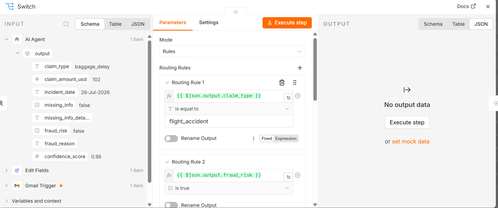
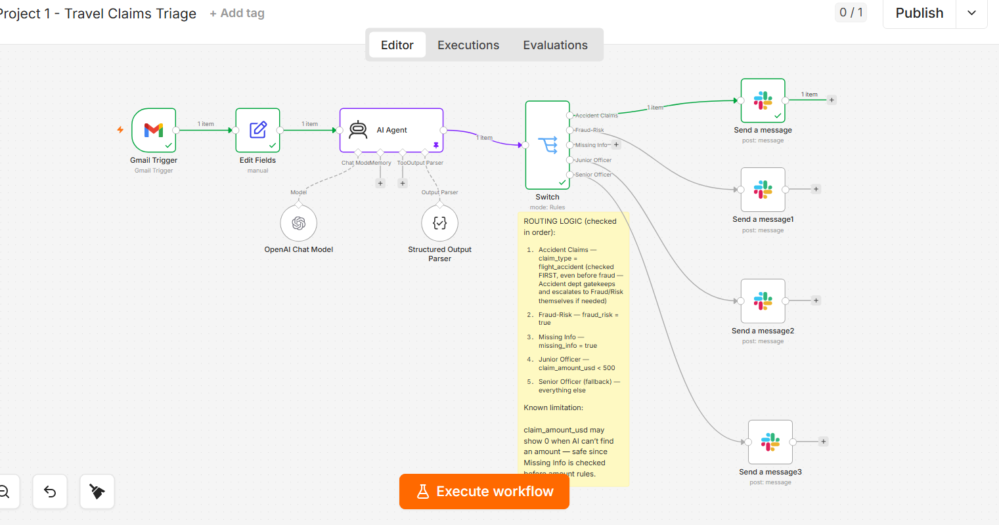
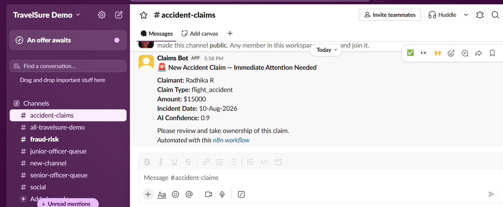
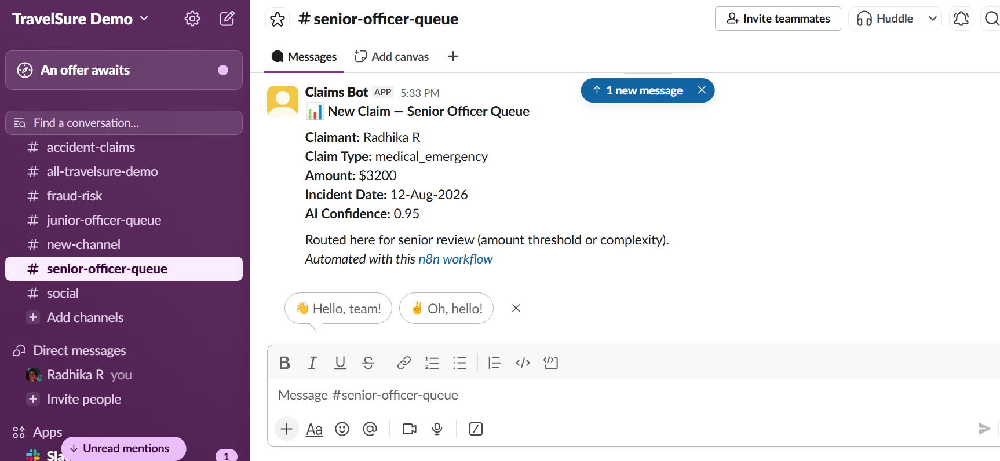
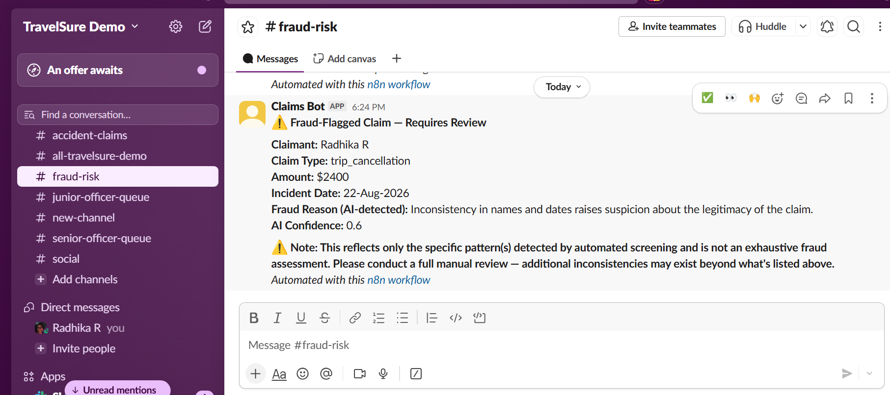

# Travel Claims Intake & Triage

**An AI-assisted n8n workflow that reads incoming travel insurance claim emails, extracts structured claim data, flags risk and missing information, and routes each claim to the right human queue — without ever making the actual claim decision itself.**

---

## 1. Problem Statement

Small to mid-sized travel insurance agencies and MGAs (Managing General Agents) typically run claims operations with a lean team — a few junior officers, a senior officer, a risk/fraud reviewer, and a customer support exec — with no enterprise claims-management system.

Today, every incoming claim email gets the same manual first-read, regardless of size, completeness, or risk. Someone has to open it, read through often-inconsistent attachments, manually extract the key details, notice if anything is missing, and *then* decide who should actually handle it. That sorting step is itself slow and inconsistent — quality varies between staff, senior time gets wasted on straightforward claims, and volume spikes during peak travel season create backlogs before a human ever makes a real judgment call.

**Cost of the problem:** slower payouts to legitimate claimants, inconsistent triage quality, and wasted senior-staff time on claims that never needed their judgment in the first place.

## 2. What This Workflow Does

This workflow reads incoming claim emails and attachments, extracts structured claim details using AI, checks for missing information and fraud/risk signals, and automatically routes each claim to the correct human queue — so the right person sees the right claim immediately, without manual first-pass sorting.

**What it does NOT do:** it never approves, rejects, or finalizes a claim, and never auto-closes a missing-info case. A human always makes the actual claim decision or follow-up contact.

This distinction is intentional and central to the design — see [Intentional Logic in the Workflow](#6-intentional-logic-in-the-workflow) below.

## 3. Routing Logic

Claims are routed using a fixed set of rules, checked in this exact order (first match wins):

| Order | Condition | Routed to |
|---|---|---|
| 1 | `claim_type = "flight_accident"` | **Accident Claims Department** |
| 2 | `fraud_risk = true` | **Risk/Fraud Department** |
| 3 | `missing_info = true` | **Customer Support** (auto-reply requesting missing details) |
| 4 | `claim_amount_usd < 500` | **Junior Officer** |
| 5 | *(fallback — everything else)* | **Senior Officer** |

**Why Accident is checked before Fraud:** the Accident Claims Department needs to be notified immediately given the severity/urgency of flight-related accidents. They act as the first gatekeeper and have the specialized context to identify accident-specific fraud signals themselves — escalating to the Fraud/Risk Department internally if something looks off, rather than this workflow making that call upstream of them.


*The Switch node's ordered routing rules, evaluated top to bottom.*

## 4. Architecture Overview

```
Gmail Trigger (label-filtered)
        ↓
Edit Fields — normalizes raw Gmail data into clean fields
        ↓
AI Agent (OpenAI gpt-4o-mini + Structured Output Parser)
   → extracts: claim_type, claim_amount_usd, incident_date,
     missing_info, missing_info_details, fraud_risk,
     fraud_reason, confidence_score
        ↓
Switch node — applies the fixed routing table above
        ↓
   ├─ Accident Claims  → Slack (#accident-claims)
   ├─ Fraud-Risk        → Slack (#fraud-risk)
   ├─ Missing Info       → Gmail auto-reply (threaded to original claim)
   ├─ Junior Officer    → Slack (#junior-officer-queue)
   └─ Senior Officer    → Slack (#senior-officer-queue)
```


*The complete workflow: Gmail Trigger → Edit Fields → AI Agent → Switch → four Slack notification branches (the fifth branch, the Gmail auto-reply for missing information, connects separately off the Switch node).*

**Trigger safety:** the Gmail Trigger only fires on emails carrying a specific Gmail label, which is itself auto-applied by a native Gmail Filter (matching claim-related emails) — not manually applied by a human. This keeps the workflow fully automatic while ensuring it never touches unrelated inbox mail.

**The AI never sees or influences routing.** Its only job is extraction and flagging. The Switch node applies fixed, inspectable business rules to that output. See [Intentional Logic](#6-intentional-logic-in-the-workflow) below for why.

### Why are there two AI models in this workflow?

The workflow uses two separate OpenAI Chat Model connections, for two different jobs:

1. **Primary extraction model** — powers the AI Agent itself, reading the claim email and producing the structured JSON output (claim type, amount, fraud signals, etc.).
2. **Auto-Fix model** — connected only to the Structured Output Parser's "Auto-Fix Format" feature. This one is used only when the primary model's response doesn't come back as valid, correctly-shaped JSON (which does happen occasionally on more complex reasoning cases). When that happens, this second model is asked to repair the malformed output and retry, without failing the whole workflow.

In short: one model does the actual claim reading; the other exists purely as a safety net for the first one's occasional formatting mistakes.

## 5. Testing

This workflow was tested at two levels:

1. **Component-level:** each node (AI extraction, routing rules, each notification branch) was individually tested against multiple hand-crafted scenarios, including edge cases (a claim that is both flagged as an accident and fraud-suspicious; a claim exactly at the $500 routing threshold; a claim with no discoverable date or amount).
2. **Live, end-to-end:** real emails were sent through the actual Gmail trigger and processed through the full pipeline with no manual data injection, including:
   - A clean, complete baggage-delay claim (happy path) → correctly routed to Junior Officer
   - A flight-caused accident claim → correctly routed to Accident Claims
   - A non-flight medical emergency claim → correctly routed to Senior Officer (confirming it did *not* trigger the accident-specific path)
   - A claim with contradictory dates and a mismatched signature name → correctly flagged as fraud and routed to Risk/Fraud, surfacing and fixing two real bugs along the way (a JSON formatting failure now handled by Auto-Fix Format, and a missing-info/fraud conflation described below)


*A live flight-accident claim, correctly classified and routed to the Accident Claims Department.*


*A live non-flight medical emergency claim — correctly routed to Senior Officer rather than triggering the accident-specific path, confirming the classification boundary holds.*


*The automated reply sent back into the original claim thread when required information is missing.*

## 6. Intentional Logic in the Workflow

These are deliberate design choices, made or refined in direct response to real testing — not defaults left unquestioned.

### AI fraud reasoning is not exhaustive, and is not perfectly consistent run-to-run

Testing showed the same ambiguous claim could surface different (but each individually valid) fraud signals across separate runs — e.g., catching a name mismatch in one run and a date inconsistency in another, rather than both at once. Rather than relying on the AI to remember to caveat its own reasoning, every Fraud-Risk Slack notification carries a **fixed, always-present disclaimer** stating that automated screening reflects only the pattern(s) detected and is not an exhaustive fraud assessment, and that a full manual review is required. This guarantees the caveat reaches every reviewer, every time, regardless of how the AI happened to phrase that particular run's output.


*Every fraud-flagged claim carries this disclaimer, regardless of what the AI's stated reasoning happens to catch that run.*

### The `flight_accident` category is narrowly and deliberately scoped

It is limited to incidents directly caused by the flight itself (turbulence, emergency landing, in-flight mechanical issue). A non-flight accident during a trip (e.g., an injury during an activity, a sudden illness) is correctly classified as `medical_emergency` instead, and currently routes through standard amount-based logic rather than any urgent escalation path. This was confirmed through live testing, which also surfaced that the AI can conflate the two categories if the email mentions medical treatment prominently — the prompt was refined with explicit cause-based definitions to correct this. Whether non-flight trip accidents deserve their own escalation path remains an open design question, not yet resolved.

### AI extracts, humans decide

The AI never chooses which queue a claim goes to — it only reports facts and risk signals (claim type, amount, missing info, fraud flags). A separate, fixed Switch node applies deterministic business rules to that output. This was a deliberate choice for two reasons:

- *Auditability:* a hardcoded business rule (e.g., "$500 threshold, fraud overrides") is inspectable and explainable to a compliance reviewer. An AI's internal reasoning for a routing decision is not, even when it's usually correct.
- *Consistency:* a rule-based node routes identical inputs identically, every time. LLMs are not perfectly deterministic — which matters a great deal in a regulated space like insurance.

### Missing information is not the same as suspicious information

Early testing revealed the AI sometimes conflated "the claimant didn't provide X" (genuinely missing) with "the claimant provided inconsistent or suspicious details" (a fraud signal, not an absence). These require different responses — one triggers an automated request for more information, the other requires quiet human review, never an automated reply that could tip off a bad actor. The prompt was corrected to explicitly separate these two concepts.

## 7. Deferred / Out of Scope

Conscious scope decisions for this build, not oversights:

- **OCR / attachment reading is not yet implemented.** The AI currently reasons only from email text. Fraud signals that would require reading a receipt or medical certificate (e.g., a document dated after the claimed incident) cannot yet be caught.
- **Currency conversion is an AI estimate, not a real exchange-rate lookup.** A production version would call a live FX API rather than relying on the model's approximation.
- **No live production deployment.** This project was built as a self-paced learning exercise; it has been tested thoroughly against both live and simulated scenarios, but has not been connected to a real claims inbox.
- **Minor known edge case:** `claim_amount_usd` may show `0` when the AI cannot find any amount in the email, rather than an explicit "unknown" marker. This is safe under the current routing order, since `missing_info` is always checked before amount-based rules — but it's not a "real" zero, and would need addressing if the routing logic ever changes.

## 8. What I'd Build Next

- OCR/vision extraction for attachments, feeding receipt and document contents into the AI's fraud and completeness reasoning
- Real-time currency conversion via an exchange-rate API
- A broader "trip accident" category (or refined `medical_emergency` handling) for non-flight incidents that may still warrant urgent review
- Slack's "wait for response" messaging, allowing a reviewer to Approve/Escalate a claim directly from Slack rather than just being notified
- Airtable (or similar) logging of every claim as a persistent, queryable record — currently every claim is routed and notified, but not yet logged to a central table
- An `Enable Fallback Model` safeguard on the AI node, and broader retry/error handling, for production resilience

---

*Built as part of a self-paced 90-day AI workflow challenge, exploring practical, trustworthy AI-assisted automation across multiple industries.*
